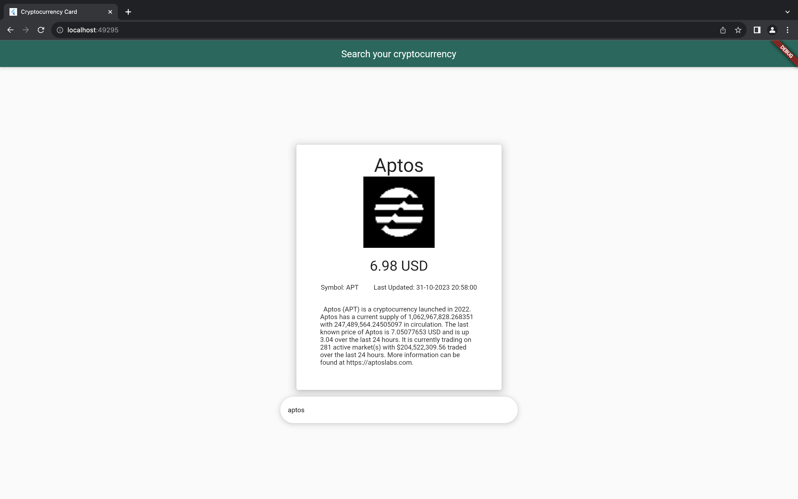

# 💰 Search your cryptocurrency card

Search your cryptocurrency card is a Flutter-based mobile application that users can request real-time information on various cryptocurrencies. Users can search for a specific cryptocurrency, and the app will display relevant data in a card format. The card includes essential information such as the cryptocurrency's name, price in USD, last updated price, symbol, and a brief description.

## 🏋🏻 Getting Started
1. Set up your environment varible in `.env` file 
- `TOKEN_API` is the API endpoint (in this case coinmarketcap is used)
-  `TOKEN_API_KEY` is the API key
```
TOKEN_API = "pro-api.coinmarketcap.com"
TOKEN_API_KEY = ......
```

2. Run the program and choose your desire device
- *This project is only tested on Chromium web browser*
```
flutter run
```

## Visual Design




### 💙 Notes
- This is my first Flutter project. If there are any errors, recommendations, comments, please feel free to share them.
- This project mainly focuses on a basic understanding of how to use Flutter.